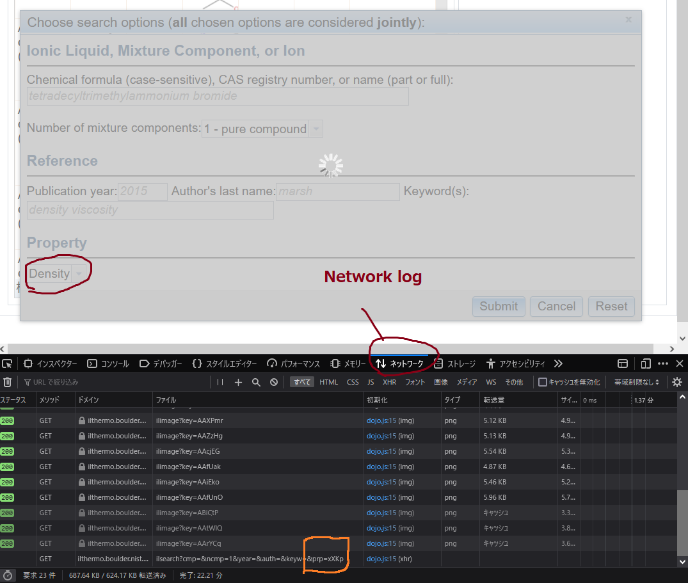

# Updated version of **pyILT2**
## Updated by Kan Hatakeyama (2022/9/30)
    - v0.9.8 to v1.0.0
    - Fix bug of property search
    - Update information is available on the bottom of this page
## Addded JSON data to convert compound names to SMILES (2023/5/10)
    - There should be some mistakes because it was semiautomatically made.
    
## Install
pip3 install --force-reinstall git+https://github.com/KanHatakeyama/pyILT2.git

# Original README

**pyILT2** is a **python library** to access the `NIST`_ *Standard Reference Database #147*,
aka Ionic Liquids Database - `ILThermo v2.0`_ .
It comes with `pyilt2report`_ , a simple **command line tool for search** requests.

.. note:: The author is not affiliated to the National Institute of Standards and Technology (NIST)!

.. warning::

    There is no official web API available to access ILThermo, which could have been used here.
    Therefore the *stability* of this library depends on the *stability* of the JSON/javascript framework of the webservice.


Documentation
-------------

Documentation including installation procedure, tutorial and API:
http://wgserve.de/pyilt2/


Requirements
------------

* Python 2 or 3
* `NumPy`_
* `Requests`_: HTTP for Humans


Cite
----

For the usage of the database ILThermo, *not* this software, please cite:

   1. Kazakov, A.; Magee, J.W.; Chirico, R.D.; Paulechka, E.; Diky, V.; Muzny, C.D.; Kroenlein, K.; Frenkel, M. "NIST Standard Reference Database 147: NIST Ionic Liquids Database - (ILThermo)", Version 2.0, National Institute of Standards and Technology, Gaithersburg MD, 20899, http://ilthermo.boulder.nist.gov.
   2.  Dong, Q.; Muzny, C.D.; Kazakov, A.; Diky, V.; Magee, J.W.; Widegren, J.A.; Chirico, R.D.; Marsh, K.N.; Frenkel, M., "ILThermo: A Free-Access Web Database for Thermodynamic Properties of Ionic Liquids." J. Chem. Eng. Data, 2007, 52(4), 1151-1159, doi: 10.1021/je700171f.


.. _ILThermo v2.0: http://ilthermo.boulder.nist.gov/
.. _NumPy: http://www.numpy.org/
.. _Requests: http://docs.python-requests.org/en/master/
.. _pyilt2report: http://wgserve.de/pyilt2/pyilt2report.html
.. _NIST: https://www.nist.gov/


# About Update
## Motivation
- Property search could not be used in the original [pip version (0.9.8)](http://wgserve.de/pyilt2/index.html)
    - This was due to the API change of ILThermo v2
- The bug was fixed

## Old use
```
import pyilt2

results = pyilt2.query(comp = "1-ethyl-3-methylimidazolium thiocyanate",
                       numOfComp = 1,
                       prop = 'dens')
```

## New use
- Use hashkey for the target property instead of using abbreviations (e.g., dens)
    - Hashkey for "density" is "xXKp"
      - This may change when the server setting is updated
```
import pyilt2

results = pyilt2.query(comp = "1-ethyl-3-methylimidazolium thiocyanate",
                       numOfComp = 1,
                       prop = 'xXKp')
```


## How to check hashkey?
- Visit [ILThermo](https://ilthermo.boulder.nist.gov/)
- Select your favorite property
- Open web developer tool of your browser
- Check your network log
- You can find hashkey
    - prp=(hashkey for the selected property)

